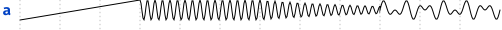
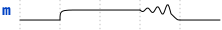
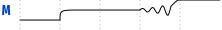

# Pywave

Pywave is an utility to transform textual representations of waveforms into images.
Textual representations has the benefit of being compatible with git versionning and diff tools.

> Thanks to the supercalifragilisticexpialidocious work and though of the wavedrom's author, on which this project is based

## Dependencies
By default, pywave only need:
- python3 in version greater than 3.5
- pyyaml
- toml

and allows to export in svg and eps (color less mode).

By adding pycairo, pywave can export in svg, eps, ps, pdf, png.

## Installation

## Usage

## Supported Syntax

[table to compare options (comments, legacy, annotations, ...)

### Json

### Jsonml

### Yaml

### Toml

## Internal Architecture

[uml bloc diagram of the architecture]
[for each presente all bricks with subsection of which parameters are supported]

### pywave.Brick

### Analogue Bricks

#### List of bricks

| Symbol |    Class   | Parameters Supported |           Image            |
|--------|------------|----------------------|----------------------------|
|    a   |   Analogue |                      |  |
|    c   | Capacitive |                      |  |
|    m   | Metastable |                      |  |
|    M   | Metastable |                      |  |
|    s   |       Step |                      |  |

#### Description

Analogue signal representations are defined in the ```analogue.py```. An analogue signal being able to go through a multitude of "levels" (voltage,current,charges...), basic assumptions have been considered.

All signals are considered to be a voltage with a Maximum excursion in $[V_{SSA}-V_{DDA}]$ range. For the sake of clarity, x-y coordinates are respectively the time and the voltage.

A brick is defined as single expression. To simplify the expression, an analogue context is loaded. This context include the extremum voltage, usual functions, an pi constant.

To be more precise, the context is given below.

```python {.line-numbers}
CONTEXT = {
    "time": [],
    "Tmax": 20,
    "VSSA": 0,
    "VDDA": 1.8,
    "atan2": math.atan2,
    "pi": math.pi,
    "exp": math.exp,
    "sin": math.sin,
    "cos": math.cos,
    "tan": math.tan,
    "tanh": math.tanh,
    "sqrt": math.sqrt,
    "rnd": random.random,
}
```

This behaviour corresponds to the *Analogue* brick whose symbol is **a**.

Other analogue bricks are an *Analogue brick* with a predefined expression.

### Digital Bricks

### Register Bricks

### Style

### BaseRenderer

## Roadmap

For the next release:
- [ ] css loader and parsing for cairo
- [ ] annotations
- [ ] edges to annotations transform
- [ ] analogue signals superposition

In long term:
- [ ] verilog sequences generation
