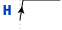
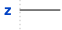

# Pywave

Textual representations has the benefit of being compatible with git versionning and diff tools. And while an image conveys thousand words, it is difficult to list changes in a specification of an electronic project when it comes to protocoles, handshakes, or impact of a digital signal on an analogue IP block.

To address this challenge, Pywave is an utility to transform textual representations of waveforms into images. The textual representations is stored, and the generated image can be displayed.

> Thanks to the supercalifragilisticexpialidocious work and thoughs of the wavedrom's author, on which this project is based

## Dependencies
At the origin, pywave only need a python3.5+. By the time, the json/jsonml format as been a tedious part in the documentation process.

In consequence, pywave also now relies on [PyYAML](https://pypi.org/project/PyYAML/) and [Toml](https://pypi.org/project/toml/).

For the rendering, SVG is the legacy format from [Wavedrom](https://wavedrom.com/). SVG is well-known and simple versatile format for the web. However, the integration into Word/Libreoffice Writer/Latex documents is the bottleneck.

So without any extra module, one can only export to SVG and EPS (colorless mode) format.

By adding [Pycairo](https://pypi.org/project/pycairo/), pywave can export to SVG, EPS, PS, PDF, PNG.

For tests the following modules are needed:
- [coverage](https://pypi.org/project/coverage/)
- [numpy](https://pypi.org/project/numpy/)
- [scipy](https://pypi.org/project/scipy/)
- [scikit-image](https://pypi.org/project/scikit-image/)

The last three are used to compare images between format and check the similarity between them.

## Installation
The recommended way to install dependencies is by typing in your shell

```bash
$> pip3 install PyYAML
$> pip3 install toml
$> pip3 install pycairo
```
To install Pywave, it is recommended the following:
- download a stable release from [github](https://github.com/LudwigCRON/pywave/releases/latest)
- unzip it as the desired place
- add in `$PATH` the pywave folder
- create an alias of your choice to simplify the call

```bash
$> wget https://github.com/LudwigCRON/pywave/archive/v0.0.2.tar.gz
$> tar -xzvf v0.0.2.tar.gz
```

In your *.bash_profile* add the following line
```bash
export PATH="PATH/TO/pywave-0.0.2:$PATH"
```

As a bonus, you can define an alias in your *.bash_aliases* file
```bash
alias pywave-svg="waveform.py -f svg"
alias pywave-png="waveform.py -f cairo-svg"
alias pywave-eps="waveform.py -f cairo-eps"
alias pywave-pdf="waveform.py -f cairo-pdf"
alias pywave="waveform.py"
```

## Usage

> For the sake of clarity, we do suppose aliases have been define during the installation process

## Supported Syntax

[table to compare options (comments, legacy, annotations, ...)

### Json
```json
{ "signal": [
  { "name": "clk",  "wave": "p......" },
  { "name": "bus",  "wave": "x.34.5x",   "data": "head body tail" },
  { "name": "wire", "wave": "0.1..0." },
]}
```

### Jsonml
in json-ml for strict compatibility with Wavedrom
```json
{ signal : [
  // clock signal
  { name: "clk",  wave: "p......" },
  // bus data
  { name: "bus",  wave: "x.34.5x",   data: "head body tail" },
  // request signal
  { name: "wire", wave: "0.1..0." },
]}
```

### Yaml
```yaml
clk:
  wave: p......
bus:
  wave: x.34.5x
  data: head body tail
wire:
  wave: 0.1..0.
```

> *notice the "signal" vanishes in yaml*

### Toml
```toml
clk.wave = "p......"
bus.wave = "x.34.5x"
wire.wave= "0.1..0."

bus.data = "head body tail"
```

> *notice the "signal" vanishes in toml*

## Internal Architecture

[uml bloc diagram of the architecture]
[for each presente all bricks with subsection of which parameters are supported]

### BRICKS
BRICKS as defined in `pywave/bricks.py` is an enumeration with common methods to apply on a new brick.

The Enumeration is a 1-to-1 map between the charactere in the wave representation and brick to create.

It also define the following methods
```python
  def transform_y(y: float, height: float = 20):
      """
      change y coordinate to represente voltage between VSSA and VDDA
      if current VSSA <-> ISSA / VDDA <-> IDDA
      """
  def from_str(s: str):
      """
      from_str return the corresponding enumeration from a char
      """
  def ignore_transition(from_symb, to_symb):
      """
      define special case when transition are skipped to prevent
      glitches by default
      """
```

### pywave.Brick
In `pywave/generic.py`, we define the class from which inherit all other bricks.

A brick is a collection of:
- paths
- arrows
- polygons
- splines
- texts

within a given box defined by `weight` and `height`properties.

Two methods have been define to ensure continuity between symbols:

```python
def get_last_y(self):
    """
    get last position to preserve continuity
    """

def alter_end(self, shift: float = 0, next_y: float = -1):
    """
    alter the last coordinate to preserve continuity
    """
```

Then a final method ensure to load the appropriate context to create a brick
```python
def generate_brick(symbol: str, **kwargs) -> dict:
    """
    define the mapping between the symbol and the brick
    """
```

Until now, only three context are existing: **Analogue**, **Digital**, and **Register**.

### Analogue Bricks
This section present the available bricks inside the analogue context.

#### List of bricks

| Symbol |    Class   | Parameters Supported |           Image            |
|--------|------------|----------------------|----------------------------|
|    a   |   Analogue |                      |  |
|    c   | Capacitive |                      |  |
|    m   | Metastable |                      |  |
|    M   | Metastable |                      |  |
|    s   |       Step |                      |  |

#### Description

Analogue signal representations are defined in the ```analogue.py```. An analogue signal being able to go through a multitude of "levels" (voltage,current,charges...), basic assumptions have been considered.

All signals are considered to be a voltage with a Maximum excursion in $[V_{SSA}-V_{DDA}]$ range. For the sake of clarity, x-y coordinates are respectively the time and the voltage.

A brick is defined as single expression. To simplify the expression, an analogue context is loaded. This context include the extremum voltage, usual functions, and pi constant.

To be more precise, the context is given below.

```python {.line-numbers}
CONTEXT = {
    "time": [],
    "Tmax": 20,
    "VSSA": 0,
    "VDDA": 1.8,
    "atan2": math.atan2,
    "pi": math.pi,
    "exp": math.exp,
    "sin": math.sin,
    "cos": math.cos,
    "tan": math.tan,
    "tanh": math.tanh,
    "sqrt": math.sqrt,
    "rnd": random.random,
}
```

This behaviour corresponds to the *[Analogue](#List\ of\ bricks)* brick whose symbol is **a**.

Other analogue bricks are an *Analogue brick* with a predefined expression.

### Digital Bricks
This section present the available bricks inside the digital context.

#### List of bricks

| Symbol |    Class   | Parameters Supported |                  Image                  |
|--------|------------|----------------------|-----------------------------------------|
|    n   |       Nclk |                      |     |
|    N   |       Nclk |                      |  |
|    p   |       Pclk |                      |     |
|    P   |       Pclk |                      |  |
|    l   |        Low |                      |     |
|    L   |        Low |                      |  |
|    h   |       High |                      |     |
|    H   |       High |                      |  |
|    0   |       Zero |                      |     |
|    1   |        One |                      |     |
|   \|   |        Gap |                      |  |
|    z   |      HighZ |                      |     |
|    x   |       Data |                      |     |
|    =   |       Data |                      |  |
|    u   |         Up |                      |     |
|    d   |       Down |                      |     |
|    i   |    Impulse |                      |     |
|    I   |    Impulse |                      |  |

### Register Bricks

This section present the available bricks inside the register context.

It is assummed that register description and signals description do not serve the same purpose. Therefore, register description shall not be mixed with signal description.

Dedicated methods are applied to transform a human textual representation of register into a waveform for rendering engines.

#### List of bricks
> *For the sake of completeness, the list of bricks are given in this section. However, the end-user do not have to deal with them*

| Symbol |    Class   | Parameters Supported |                  Image                  |
|--------|------------|----------------------|-----------------------------------------|
|    [   | FieldStart |                      | |
|    ]   |   FieldEnd |                      |   |
|    :   |   FieldMid |                      |   |
|    b   |   FieldBit |                      |   |

### Style
[dev-mode only]

### Renderer
Renderer is base class from which inherit all rendering engine.

It defines usefull methods 

It also define `svg_curve_convert(vertices: list)` method to the svg [path command](https://developer.mozilla.org/en-US/docs/Web/SVG/Tutorial/Paths) into derivative rendering engine.

## Roadmap

For the next release:
- [ ] css loader and parsing for cairo
- [ ] annotations
- [ ] edges to annotations transform
- [ ] analogue signals superposition
- [ ] analogue context personalization

In long term:
- [ ] verilog sequences generation
- [ ] sphinx integration

## Use cases

A great power implies great responsabilities! As each characteres count there combination could lead to an undesired effect.

To avoid an surprise, this section demonstrate several scenarii.

### Glitched Clock
```yaml
gated clock n:
    wave: "N0...Nl"

gated clock p:
    wave: "P0...Pl"
```

